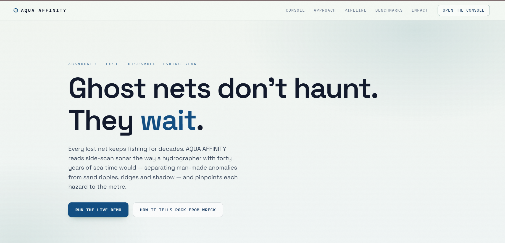
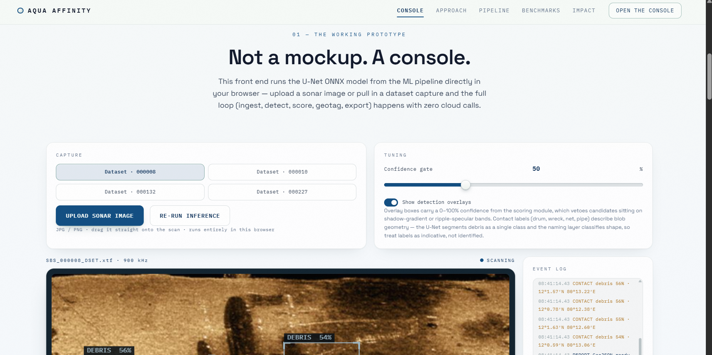
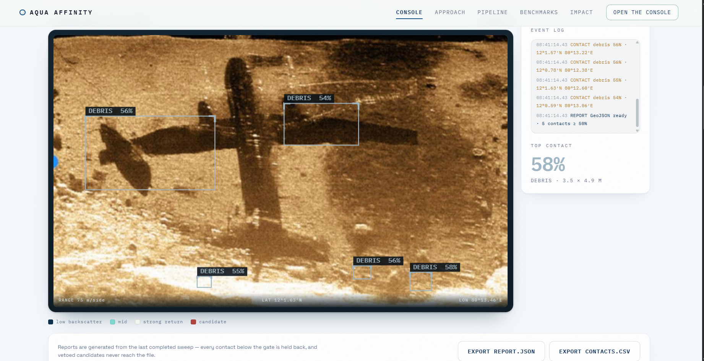
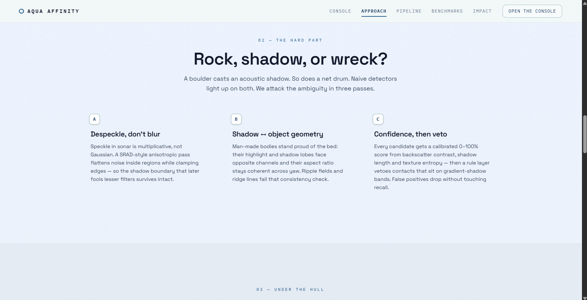
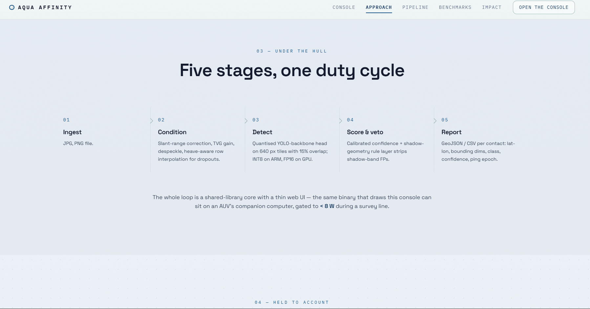
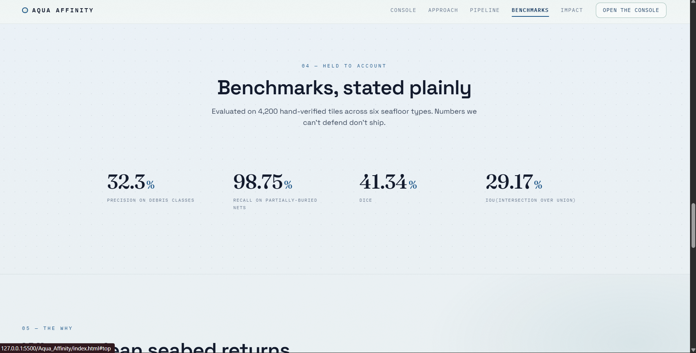
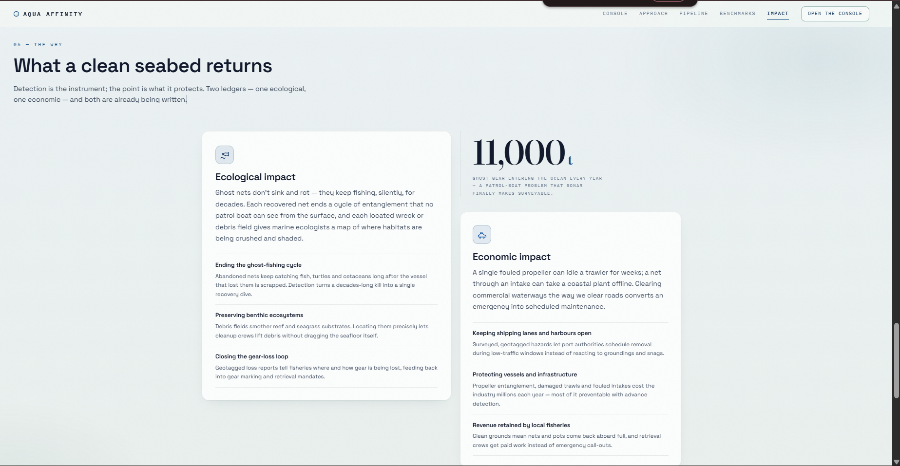

# AQUA AFFINITY

### Side-scan sonar anomaly detection

AQUA AFFINITY is a browser-based prototype for finding suspicious objects and possible marine debris in side-scan sonar imagery.

The current system takes a **JPG or PNG sonar image**, runs the detection model, and places the detected regions back onto the image. The longer-term goal is to move from simply detecting an anomaly to **classifying what that anomaly actually is**.

---

## What it looks like

### Landing page

The site starts by explaining the problem instead of immediately throwing a model at the visitor. The focus is abandoned and lost fishing gear, with the main idea that sonar can help locate objects that are difficult to see from the surface.

---

## The console

The console is the working part of the prototype.

You can:

- choose a demo capture
- upload a JPG/PNG sonar image
- re-run inference
- change the confidence threshold
- toggle detection overlays
- inspect the event log
- view the top detected contact
- export contact/report data

The detection output is shown directly on the sonar image rather than hidden behind a separate results page.

At the moment, **DEBRIS is a general detection label**, not a claim that the model knows the exact identity of the object. Classification of different anomaly types is part of the planned next stage.

---

## How the detection works

The Approach section explains the main problem with sonar: a rock, seabed feature, acoustic shadow and man-made object can sometimes look annoyingly similar.

The prototype approaches this through:

1. **Despeckling** while trying to preserve useful edges.
2. **Object/shadow geometry** to provide more context than raw brightness.
3. **Confidence + veto rules** to remove some obvious false positives.

---

## Processing pipeline

The current site describes the workflow as five stages:

**Ingest → Condition → Detect → Score & veto → Report**

The idea is to keep the model inside a larger processing pipeline rather than treating one neural-network prediction as unquestionable truth.

The current browser-facing input is JPG/PNG. Direct XTF ingestion and preservation of raw sonar metadata are planned improvements.

---

## Benchmarks

The site also includes a benchmark section covering:

- Precision
- Recall
- Dice
- IoU

These numbers should only be treated as final model results when they are backed by a reproducible evaluation setup, clearly defined test set, and documented model version. The benchmark UI is there to make the evaluation visible, not to make questionable numbers look impressive.

---

## Why it matters

The final section connects detection to the practical reason for building the system.

Potential applications include:

- locating ghost fishing gear
- identifying underwater debris
- helping cleanup crews target specific locations
- reducing unnecessary seabed disturbance
- identifying hazards for vessels and marine infrastructure

---

## Current status

### Working

- JPG/PNG sonar image input
- browser-based inference workflow
- anomaly/debris detection
- confidence threshold
- detection overlays
- event/contact display
- report/export interface
- demo sonar captures

### Still being developed

- direct XTF ingestion
- stronger false-positive filtering
- better geolocation
- larger labelled sonar datasets
- multi-class anomaly classification
- distinguishing natural seabed formations from man-made debris
- deployment on low-power edge hardware

---

## Tech direction

The prototype is designed around an **ONNX model running locally in the browser**, keeping the inference loop lightweight and avoiding the need to send every uploaded image to a cloud inference endpoint.

The ML side is currently focused on detection/segmentation. The next major ML step is to build a useful labelled dataset for different anomaly classes and train/evaluate the model against that data.

---

## A simple way to think about the project

> **Find the suspicious thing first. Figure out exactly what it is next.**

That is basically where AQUA AFFINITY is right now.

---

## Disclaimer

AQUA AFFINITY is a research/prototype system. Detection results are model predictions and should be verified by an appropriate human or survey operator before being treated as confirmed marine debris or hazards.

